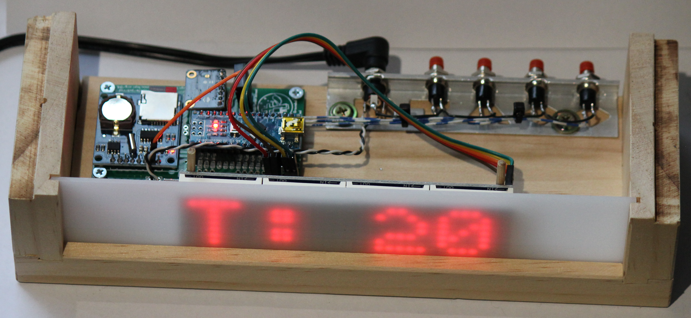

# erichVK5-air-quality-monitor-v2
A leaner version of the original erichVK5 air quality monitor

The PCB and accompanying software allow the CCS811 sensor to be used to monitor CO2 and total volatile organic compounds, and the AM2320 sensor allows humidity and temperature to be recorded as well.

This is a leaner version of https://github.com/erichVK5/erichVK5-air-quality-monitor, achieving a significant cost reduction by using an Arduino nano and a compact Deek Robot 8122 RTC/SD board on a custom PCB which also mounts the DF Robot CCS811 CO2/VOC sensor board and the AM2320 temperature/humidity sensor. 

The revised v2 PCB was designed in pcb-rnd and simplifies the connections between the TM1637 display, CCS811 sensor, AM2320 sensor and Arduino Nano. The PCB dimensions have been carefully chosen to allow efficient panelisation on standard panel sizes if ordering larger quantities from PCB suppliers. By mounting the sensors, RTC, data logging and Arduino subassemblies on a single PCB, the build cost can be roughly halved. 

The board is code compatible with the original air quality monitor, except for the real time clock, which uses a DS1307 instead of a PCF8523. The board has been designed to allow the option of mounting an Arduino Nano Every, but care must be taken if there are plans to use an external 5V power supply for the board, as the Arduino Nano Every, unlike the Arduino Nano, can apparently backfeed 5V down an inserted USB cable to a host.

Low cost data logging air quality monitors remain useful in educational and community settings to provide a qualitative indication of air quality over time. In particular, CO2 levels can be a useful proxy for air turnover in built environments, and by extension, inform measures that seek to reduce the risk of persisting airborne pathogens. The utility of CO2 as a proxy for airborne pathogen loads will be affected by sources of combustion or fermentation (i.e. processes producing CO2 in addition to people) in the indoor space, and by the use of air purifying devices, such as those circulating air through suitable filters.

The PCB has a footprint allowing connection to an inexpensive TM1637 based four digit LED display for the display of readings, but with suitable code modification, other display options are possible. For example, here is a build using a MAX7219 based 8x32 LED Matrix:

After assembly of the PCB headers and sub-boards is complete, following the pictorial guide in the images subdirectory, a battery can be installed on the Deek Robot 8122 datalogging board. The DS1307 clock example code available within the arduino library manager can then be used to set the current time.

In addition to taking and displaying readings every 10 seconds, the accompanying code will write time stamped readings to an SD card every three minutes.

After reset, if all goes well, an initial flash screen "LLS" should appear, after which readings will be displayed sequentially, with new readings being taken every 10 seconds. Every three minutes, cached readings are written to the SD card.

The Deek Robot 8122 datalogging board requires a CR1220 battery for the DS1307 real time clock, and will require a FAT16 or FAT32 formatted SD card of between 32MB and 32GB in size.

The unit should be powered down before inserting or removing the SD card.

Data logs are written in CSV format, with sequential naming starting with LLSAQM00.CSV

During operation, updated readings are displayed sequentially on the 4 digit LED display.

- Temperature readings in Centigrade are preceded by "t" on the LED display
- Humidity readings in percent are preceded by "h" on the LED display
- Carbon dioxide readings in ppm (parts per million) are preceded by "CO2" on the LED display
- Total volatile organic compound readings in ppb (parts per billion) are preceded by "tvoc" on the LED display

The code also streams results over USB as a serial device, allowing readings to be viewed as they are collected in a serial monitor in real time.

It is recommended that the CCS811 be given a 48 hour initial burn in period and be allowed 20 minutes for the sensor to warm up to provide reliable readings thereafter.

The v2 PCB layout can be opened in pcb-rnd, and gerbers for the shield have been provided in a zip file to allow ordering from the usual online PCB suppliers.

The schematic for the v2 board is essentially identical to that of the original version, with SCL using A5 and SDA using A4 on the Arduino Nano.

For data transfers to and from the SD card, the Deek Robot 8122 datalogging board uses SPI on the following Arduino Uno pins:

- SCK
- MISO
- MOSI
- D10 as CS (chip select)

For real time clock operations, the Deek Robot 8122 datalogging board also shares the i2c bus with with the CCS811 and AM2320 sensors, using the following pins:

- SDA(A4)
- SCL(A5)

This leaves multiple pins free on the Arduino Nano if code customisation is needed, such as for on/off signals for fans or building ventilation systems. Spare pins on the arduino nano have been broken out to pads, to allow wiring to other actuators, sensors or switches.

The v2 PCB also has pads to connect external Vin to the Arduino Nano. Builders must ensure that the overall power demands of their display and assembled unit will fall within that which can be provided by the Arduino Nano voltage regulator.

ALternatively, there is also footprint provided on the v2 PCB for a connector for provision of an external 5V supply to the 5V rail (instead of relying on USB for power) that feeds the peripherals and Arduino Nano 5V pin, BUT(!)... although a standard Arduino Nano can be powered via the 5V pin from an external source without backfeeding the voltage down the USB cable to the host, an Arduino Nano Every will apparently allow the power supplied via the 5V pin to go up the USB cable to a host, if connected.

The DS1307 real time clock seems to be a little sensitive to power supply noise. If there are issues with the clock not updating, it may be worth trying some filtering on the power supply, and/or some decoupling capacitors to smoothe the supply.

Unlike the Adafruit data logging shield which includes 10k pullup resistors for the SDA and SCL lines, they may not be as strong or may be absent on the Deek Robot 8122 datalogging board. Accordingly, for reliable operation with the clock, DF Robot and AM2320 sensors all on the same i2c bus, pullup resistors (4k7 or 10k) should be added to link Vcc to the SDA and SCL lines. A revised version of the board (v2.1) has footprints for the addition of pullup resistors if needed. 

The v2 PCB also has a footprint to allow the use of a MAX31855 thermocouple, if builders are keen to experiment with temperature measurement, display and control of various hot processes.

# LED Matrix clock build

The pins for the MAX31855 thermocouple supply most of the needed connections for an SPI driven display, such as commonly available MAX7219 LED matrices. The example build shown above uses an 8x32 MAX7219 LED matrix instead of the TM1637, connected to GND, 5v, SCK, and D9 for CS on the MAX31855 header, and MOSI (accessed on the RTC/SD board header).

A simple code example has been provided which provides some of the functionality of the TM1637 build but using a MAX7219 based 8x32 LED Matrix, along with code to read A0-A3 connected button presses to adjust the time if required. The main differences are that it does not stream results to serial, display of tvoc has not been implemented, and it does not log data to the SD card.

It displays temperature for 4 seconds, humidity for 4 seconds, CO2 for 4 seconds, and then the time for 48 seconds, after which the cycle repeats.

The LED matrix based build was conceived of as more of an example of how an inexpensive clock with environmental sensing could also be implemented with the v2 PCB, rather than simply another version of the same data logging air quality monitor. The aluminium bracket used for the switches and DC socket was surplus tile edging, and the white diffuser panel was found in a discarded fax/printer.

Again, it is worth noting that the DS1307 real time clock seems sensitive to power supply noise, so it may be worth trying some filtering on the power supply, and/or some decoupling capacitors to smoothe the supply if glitches are noted.

# Clock Drift Adjustment

The latest version of the clock code has the necessary code to adjust the real time clock (RTC) by one second every X seconds; but this requires the user to determine how fast the clock is running fast or slow.

In the prototype build, the clock ran 5.75 seconds fast every 24 hours. This was found by noting the clock ran 8 minutes 26 seconds (= 506 seconds) fast over 88 days. This allowed the number of seconds per day fast or slow (5.75 seconds), to be calculated.

Given that there are 86,400 seconds in a day, this enabled the simple calculation 86400/5.75 showing that the RTC runs one second fast every 15026.0869 seconds.

The code simply waits until 15026 seconds (the amount is defined at compile time in the code) have elapsed before subtracting one second from the RTC. It then waits 2 seconds to avoid an endless time correcting loop. If you can calculate the drift, you can now adjust the clock. 
